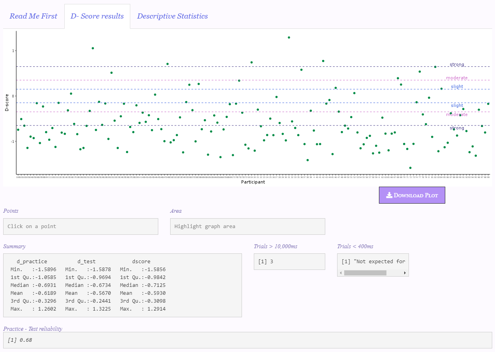
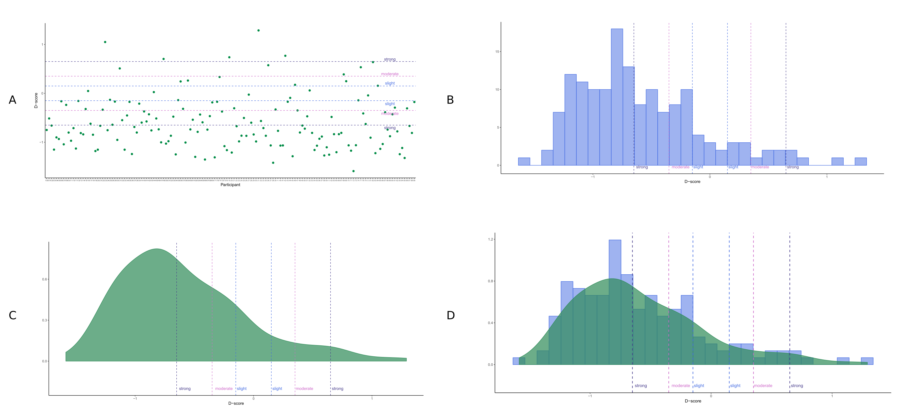

# Summary

The Implicit Association Test [IAT; @Greenwald:1998] is one of the most commonly used measures in psychology for the implicit assessment of attitudes and preferences. It is based on the speed and accuracy with which stimuli representing four different categories (e.g., flowers and insects, positive and negative words in a Flowers-Insects IAT) are sorted in their belonging category by means of two response keys. The IAT is usually composed of seven blocks, three of which are pure practice blocks where either flowers-insects images or positive-negative words are sorted in their categories. The remaining four blocks are associative practice and associative test blocks. These blocks forms the two contrasting associative conditions under which the categorization task takes place. In one associative condition (i.e., practice blocks Mapping A and test blocks Mapping A), images of flowers and positive words share the same response key, while images of insects and negative words share the other response key. In the contrasting associative condition (i.e., practice blocks Mapping B and test blocks Mapping B), images of insects and positive words share the same response key, while images of flowers and negative words share the opposite response key. 

The categorization task is supposed to be easier (i.e., having faster response times and higher accuracy) in the associative condition consistent with respondents' automatically activated associations. The *IAT effect* results from the difference in respondents' performance between the two contrasting conditions, and the *D-score* [@Greenwald2003] is the most common measure used for interpreting the strength and direction of this effect. Despite the fact that different options are available for the *D-score* computation (Table 1), the core procedure is the same. The difference between the *D-score*s only concerns the treatment for the error responses and the treatment for the fast responses. 

Table: *D-score* algorithms overview. Trials with latency $> 10,000$ ms are discarded for all the algorithms.

| D-score | Error treatment                         | Lower tail treatment     |
| :------ | :-------------------------------------- | :----------------------- |
| D1      | Built-in correction                     | No                       |
| D2      | Built-in correction                     | Delete trials $<$ 400 ms |
| D3      | Mean (correct responses) $+ 2$ *sd*     | No                       |
| D4      | Mean (correct responses) $+ 600$ ms     | No                       |
| D5      | Mean (correct responses) $+ 2$ *sd*     | Delete trials $<$ 400 ms |
| D6      | Mean (correct responses) $+ 600$ ms     | Delete trials $<$ 400 ms | 

During IAT administration, respondents might be given feedback for the error responses. In this case, participants are presented with a red cross every time they incorrectly sort a stimulus, and they have to correct their response to proceed with the experiment. If a feedback strategy is not included, respondents are not notified when they commit an error and they can continue the experiment. The inclusion of the feedback procedure will influence the *D-score* algorithms that can be computed. When a feedback strategy is given, a *D-score* algorithm employing a built-in correction (i.e., the error responses are increased with the time needed to correct them) must be used (i.e., *D1* and *D2*), otherwise (i.e., *D3* to *D6*) an *a posteriori* correction is used (i.e., error responses are replaced by the average response time increased by a standard penalty, see Table 1). The lower tail treatment strategy deals with the decision to discard responses with latencies faster than $400$ ms or not. Once the treatment for error and fast responses have been applied according to the specific algorithm, it is possible to compute the *D-score*, following a 3-step procedure: 

1. Compute the *D-score* for the associative practice blocks (i.e., $D_{practice}$) as the difference between the average response time in the two contrasting associative practice blocks. This difference is divided by the standard deviation computed on the pooled trials of both blocks.

2. Compute the *D-score* for the associative test blocks (i.e., $D_{test}$) as the difference between the average response time in the two contrasting associative test blocks. This difference is divided by the standard deviation computed on the pooled trials of both blocks.

3. Compute the actual *D-score* as the mean of the $D_{practice}$ and the $D_{test}$.

Several options are available for computing the *D-score*, for example, SPSS commands, Inquisit scripts, and `R` packages. These options all have some drawbacks, such as the need for a license (SPSS commands and Inquisit scripts), the need for programming skills (`R` packages), or the need for a specific administration procedure to be used (Inquisit scripts) 

An open source and user-friendly tool for the computation of the *D-score* was hence created in `R` [@rsoft] using the shiny [@shiny] and shinijs [@shinyjs] packages. This tool provides an immediate representation of the results, combining graphical representations with descriptive statistics. 

# DscoreApp

[DscoreApp](http://fisppa.psy.unipd.it/DscoreApp/) (v0.1) was developed with the aim of providing an Open Source tool able to make the *D-score* computation easier for researchers who commonly employ the IAT but have little or no programming experience. Furthermore, by providing an immediate representation of the results, it allows for an immediate glimpse of the IAT results. The source code of DscoreApp can be retrieved on [GitHub](https://github.com/OttaviaE/DscoreApp).

The app is organized in different panels ("Input", "Read Me First", "D-score results", and "Descriptive statistics"), and it comes with a toy data set that can be used to familiarize oneself with its functions. The setting options and functions in the "Input" panel and the menu in the "Read Me First" panel are interactive, so that users can easily access the information on DscoreApp functions and amenities. 

The "Read Me First" panel provides important information on DscoreApp functioning, including an overview of the *D-score* algorithms. It includes a downloadable template suggested for using the app (i.e., **Download template** button), even though it is not necessary to use it. Indeed, DscoreApp is designed to work as long as the uploaded data set is in a CSV format, using comma as the column separator, and includes the following variables: `participant` (i.e., participants' IDs), `latency` (i.e., response latencies in milliseconds), `correct` (response accuracy, either 0 for error responses or 1 for correct responses), `block` (i.e., labels identifying the four associative blocks of the IAT). This panel also contains information on the downloadable file that can be retrieved after the *D-score* computation. 

The "Input panel" is the panel for uploading either the toy data set (`Race IAT dataset` checkbox) or a user's own data set (**Browse** button). Once the data set is read, the app automatically populates the drop-down menus for choosing the labels of the four associative blocks, and the **Prepare data** button is activated. When data are ready for the *D-score* computation, the `Data are ready` message appears next to the **Prepare data** button, and all the options for its computation and graphical display become active. Once a *D-score* algorithm is chosen from the drop-down menu `Select your D`, the **Compute & Update** button is activated. Users can decide whether to eliminate participants whose error percentage exceeds a specified threshold [default is 25% according to @Nosek2002] or whose fast responses ($< 300$ ms) exceed 10% of the total responses [@Greenwald2003]. When these options are selected, participants exceeding the thresholds (if any) will not be displayed in the "D-score results" panel. Every time a change in the configuration is made, the **Compute & Update** button must be clicked to apply the changes. 

The "D-score results" panel (depicted in Figure 1) is populated once the **Compute & Update** button is clicked for the first time. Both descriptive statistics of the results and their graphical representation are available at the same time, and they change interactively as users change the configuration in the "Input panel". The `Summary` box reports the descriptive statistics of the $D_{pratice}$, $D_{test}$, and the actual $D$-$score$. The `Trials > 10,000ms` box reports the number of trials discarded because of a slow latency (if any), while the `Trials < 400ms` box reports the trials discarded because of fast response times, only if a *D-score* algorithm that includes the fast trials deletion strategy was chosen. The `Practice-Test reliability` box contains the IAT reliability computed as the correlation between associative practice and associative test blocks across participants [@gaw2017].

DscoreApp provides users with different options for the graphical representation of the results (depicted in Figure 2), at both the individual and sample level. Graphical representation is a convenient way to identify extreme scores or particular response pattern. Since it might be difficult to link a particular point (or points area) in the graph with the corresponding participants' IDs in the data set, DscoreApp comes with two handy tools designed to access the respondents' IDs from the graph. By clicking on a point in the graph, the ID of the participant that corresponds to the selected point, and his/her *D-score*, appears in the `Point` box. By highlighting an area of the graph, the IDs of participants included in the area, along with their *D-score*s, appears in the `Area` box.  

Both the graphical representations and the results of the computation are downloadable. The graphical representations are saved in a PDF format. The downloadable file of the results is saved as a CSV file with a comma used as the separator. Further details on the variables and information contained in this file are available in the "Read Me First" panel of the app.

DscoreApp is frequently updated by the authors, and new functions that are not present in this paper might be available in the future (e.g., other IAT reliability indexes).

## Acknowledgments

O.M.E. wanted to thank Ben Keller for his suggestions and advice.  

# References
